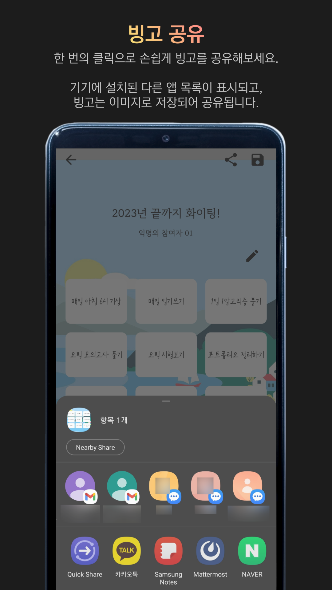
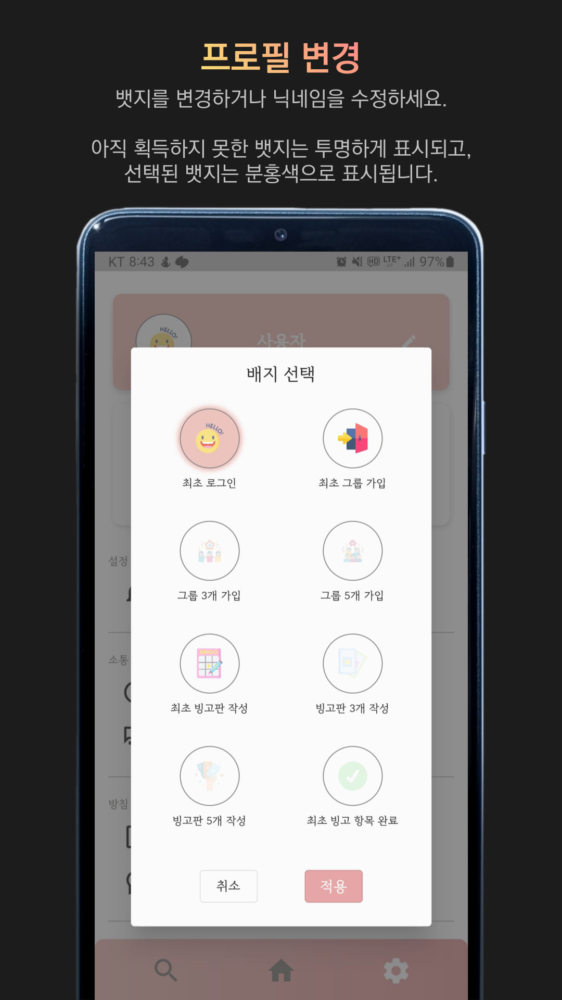

# Bin-goT


<br/> <br/> <br/>

## 0. 목차

- [1. 개요](#1-개요)
- [2. 주요 기능](#2-주요-기능)
- [3. 서비스 아키텍쳐](#3-서비스-아키텍쳐)
- [4. 기술 특장점](#4-기술-특장점)
- [5. 팀 컨벤션](#5-팀-컨벤션)

<br/> <br/> <br/>

## 1. 개요

**Bin:goT** 은 빙고판 형태의 목표 달성 모임 플랫폼입니다. 그룹을 생성하여 같은 목표를 가진 사람들과 함께 빙고판을 만들고, 기간 내에 가장 먼저 빙고판을 가득 채워보세요. <br/>

### [Google Play Store 등록 심사 중]()


- 팀명: 채울(chaewool)
- 개발 기간: 2023.01.08 ~ 2023.10.24 (약 43주)

  - 기획 및 설계 : 2023.01.08 ~ 2023.01.28 (약 3주)
  - 학습 및 개발 : 2023.01.25 ~ 2023.09.20 (약 35주)
  - 점검 및 마무리 : 2023.09.20 ~ 2023.10.24 (약 5주)

- 인원
  | [나원경](https://github.com/hitriee) | [조예지](https://github.com/celpegor216) |
  | :----------------------------------: | :--------------------------------------: |
  | FE, QA | FE(Notification), BE, Infra |

<br/> <br/> <br/>

## 2. 주요 기능

### 2-1. 그룹

| 그룹 생성 | 그룹 정보 및 랭킹 조회 | 그룹 채팅 | 그룹 검색 |
| :-: | :-: | :-: | :-: |
|  |  |  |  |

<br/>

### 2-2. 빙고

| 빙고 생성 | 빙고 정보 및 인증 요청 생성 | 빙고 저장 | 빙고 공유 |
| :-: | :-: | :-: | :-: |
|  |  |  |  |

<br/>

### 2-3. 회원

| 소셜 로그인(Kakao) | 참여 목록 확인 | 프로필 변경 | 설정 및 도움말 |
| :-: | :-: | :-: | :-: |
|  |  |  |  |

<br/> <br/> <br/>

## 3. 서비스 아키텍쳐

### 3-1. 서버 아키텍쳐


### 3-2. ERD


<br/>

### 3-2. 기술 스택

| **Part**               | **Stack**                                                    |
| :--------------------: | ------------------------------------------------------------ |
| **Frontend**           |  |
| **Backend**            |  |
| **Deployment**         |  |
| **Collaboration Tool** |  |

<br/> <br/> <br/>

## 4. 기술 특장점

### 4-1. FE

- Provider를 이용한 상태 관리 수행
- Bottom Bar, Scroll, Page View 등을 이용한 효율적인 앱 화면 구성
- Firebase Cloud Messaging을 이용한 알림 기능 구현
- Enum, Typedef, 함수 재정의 등을 이용한 코드 축소 및 개발 편의성 증대

<br/>

### 4-2. BE

- APScheduler를 적용한 알림 전송 배치 작업 수행
- Kakao SDK를 활용한 카카오 소셜 로그인 기능 구현
- 반복적으로 사용되는 함수들의 재사용성을 높이기 위한 모듈화 진행

<br/>

### 4-3. Infra

- Jenkins를 활용한 자동 배포 환경 구축
- Docker, docker-compose를 사용하여 백엔드 서버 컨테이너화
- NginX를 적용하여 포트 포워딩 및 리버스 프록시 환경 구축

<br/> <br/> <br/>

## 5. 팀 컨벤션

### 5-1. 커밋 컨벤션

- 커밋 메시지 형식
  ```
  #git이슈번호 종류 : 내용(영어)
  ```
- 커밋 메시지 종류
  | 이모티콘 | 종류 | 내용 |
  | - | - | - |
  | ✨ | feat | 기능 추가 |
  | 🐛 | fix | 코드 관련 버그 수정 |
  | 📝 | docs | 문서 수정 |
  | 🎨 | style | 코드 작성 스타일 수정 |
  | 🙈 | chore | 패키지 매니저, 빌드 등 기타 코드 수정 |
  | ♻️ | refactor | 코드 리팩토링 |
  | ✅ | test | 테스트 코드 추가 |

<br/>

### 5-2. 이슈 컨벤션

```md
> 이슈명은 `[ALL] 기능(영어)`로 적어주세요

<br>

## 기능 설명

-
- <br>

## 완료 조건

- [ ] 1
- [ ] 2
```

<br/>

### 5-3. PR 컨벤션

```md
---
title: "[FE/BE] feat : "
---

> 제목은 `[FE/BE] 종류 : 기능(영어)`로 작성해주세요. <br>

feat - 기능 추가
fix - 버그 수정 (코드 관련 수정)
docs - 문서 수정 (README.md)
style - 스타일 관련 기능(코드 포맷팅, 세미콜론 누락, 코드 자체의 변경이 없는 경우)
chore - 빌드 업무 수정, 패키지 매니저 수정(ex .gitignore 수정 같은 경우)
refactor - 코드 리팩토링
test - 테스트 코드

> 라벨은 FE, BE 중 하나를 선택해주세요

<br>

## 관련 이슈

- closes (이슈 번호)

<br>

## PR 생성 전 확인 사항

- [ ] Warning Message가 발생하지 않았나요?
- [ ] Coding Convention을 준수했나요?
- [ ] Conflict를 해결했나요?

<br>

## 작업 내용

-
-

<br>

## PR 특이 사항

-
-
```
